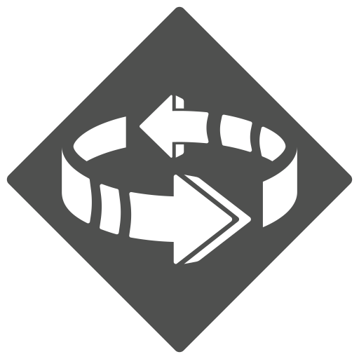

[1. Released classes](#1-released-classes)

1. [Jester Twins](#11-jester-twins)

[2. Custom conditions and effects](#2-custom-conditions-and-effects)

1. [Swing](#-swing)

___

## 1. Released classes

### 1.1 Jester Twins

**Swing?** Please refer to the official ruling on [Swing](#-swing) for more information. As a rule of thumb, you **cannot** change directions when swinging an enemy. Swing **is** affected by icy terrains, the target move in the direction of the point of movement that moved them into the icy terrain, when they exited icy terrains, you can resume swinging with the new relative distance. 

**What happens when the scenario effects, road events or outpost events force characters to gain a condition?** Both Twins gain the condition. Curse (and Bless, if applicable) will apply twice.

**What happens when the scenario effects force characters to add a -1 modifier to their deck?** You only add one -1 card.

**Can I switch the position of the twins when they're stacked?** No, the Twins need to be unstacked then stacked again to be able to change position.

**What happens in an escape scenario?** Both the twin need to escape in order for the scenario to be completed. When they are stacked, they can escape through the same hex.

**Items?** Either twin can activate items to perform/gain the benefits written on the item. Items with use slot are triggered by both twins. Items with passive bonuses are gained by both twins. Here are a list of FH items that are potentially confusing:

  
FH items 41, 132, 240, 243

  Only apply once.

  
FH items 180

  Looting is counted separately.

  
FH items 03, 11, 58, 66, 79, 144, 146, 171, 178, 223

  Only applies to one twin.

  
FH items 53, 139, 143, 152, 206

  Counts the movement of the twins separately. Only the bottom twin is counted as moving when they are stacked.

  
FH items 21, 36, 48, 130, 138, 147

  Applies to both twins.

**Scenarios?**

  
FH Scenario 15

  If the twins are stacked, both twins can move from a to b and stay stacked. If they are unstacked when either move from a to b, the remaining twin is left behind and can no longer leave tile 15-D (not recommended).

  
FH Scenario 41

  Either twin can loot the numbered token. However, both twins need to be adjacent to the altar to return the looted token.

  
FH Scenario 43

  Place the number token on your mat, either twin can use it. When it is used, it's flipped face down and cannot be used by either until after the next long rest.

  
FH Scenario 49

  Place 7 tokens on your mat as usual, each entire action (not ability) cost 1 oxygen. You only need one twin to occupy the air pocket A to refill all oxygen tokens. If you perform while you have no oxygen, both twins must suffer trap damage.

  
FH Scenario 51

  You can forgo a top action (neither twin can perform it) to have either of them use the explosive.

  
FH Scenario 60

  Each twin get Curse twice, which means you add 4 curses to the deck. Either twin can loot and gain a coral shard, both gets the benefit of carrying coral shards. Either of them can also give a shard from their character mat to an adjacent ally. 

  
FH Scenario 66

  Either twin can loot an elemental core and either can use the core on their character mat to activate an "A" hex. 

  
FH Scenario 126

  Either twin can loot a token, place it on their character mat and deliver it to a Helper.

  
FH Scenario 127

  Either twin can loot crates. If the twins are stacked, the bottom twin can spend 2 movement points when occupying the stairs to go below deck, they remain stacked. 

  
FH Scenario 133

  If the feline idol is placed on the jester twin's mat, both of them will get the effects of carrying the idol. 

## 2. Custom conditions and effects

###  SWING

**Swing** is a forced movement ability similar to **push** or **pull** except its movement is ***around*** the acting figure rather rather than away or towards. When any figure performs "**Swing X**", the target is forced to move up to X hexes in a single direction, clockwise or counterclockwise. Each individual hex entered must maintain the ***same*** distance between the target and the acting figure.

As with push and pull, **swing** is unaffected by difficult terrain, but all other normal movement rules are still applied, and if there are no more valid hexes for the target to enter, the **swing** ends.

Any figure immune to forced movement is immune to **swing**, but immobilized or stunned figures can still be **swung**.

A figure can only target enemies with **swing** unless otherwise specified.

Multiple **swing** effects are combined. For example, if an ability with "**swing 1**" gains "**swing 2**," the results is a "**swing 3**" ability.

It is possible for the target to change their distance to the acting figure ***during*** the **swing** such as in the case of a non-flying target being **swung** into a hex with icy terrain. In such a case the **swing** may continue in the same direction and at the new distance.
